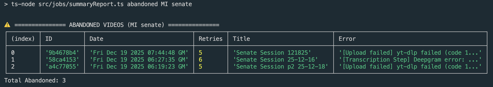

# StatePipe Video Ingestion Engine

A high-reliability automated pipeline for monitoring, scraping, and transcribing US State legislative videos.

Currently supports:

- [Michigan House](https://house.mi.gov/VideoArchive)
- [Michigan Senate](https://cloud.castus.tv/vod/misenate)

## 🛠 Technical Stack

| Component     | Technology                                      |
| :------------ | :---------------------------------------------- |
| **Runtime**   | Node.js + TypeScript                            |
| **Database**  | AWS RDS PostgreSQL (Persistence & Job Tracking) |
| **Cloud**     | AWS S3 (Media Storage)                          |
| **Parser**    | Cheerio (HTML Scraping)                         |
| **CLI Tools** | `yt-dlp` (Stream Extraction)                    |
| **AI/ML**     | Deepgram (Speech-to-Text)                       |

## ⚙️ Core Workflow

The engine follows a structured state machine to ensure data integrity:

1. **Maintenance:** Clears stale job locks from previous interrupted runs.
2. **Discovery:** Executes state/source-specific scrapers to identify new hearings.
3. **Ingest:** Downloads media via yt-dlp and streams it directly to S3 (zero local disk storage).
4. **Transcribe:** Sends S3 media to Deepgram; results are indexed in Postgres.
5. **Monitor:** Provides real-time logging and health reporting with success-rate metrics.

---

## 🚀 How to Use

### Installation

1. Install dependencies:

   ```bash
   npm install
   ```

2. Ensure `yt-dlp` is installed and available in your system PATH.

### Database Setup

1. Connect to RDS:
   ```bash
   psql -h <host> -U <user> -d <database>
   ```
2. Initialize schema:
   ```bash
   \i db/schema.sql
   ```

### Execution

The engine uses a "lane" architecture. Start a worker for a specific state and branch:

```bash
npm run build
npm start -- --state=MI --source=senate --days=7
```


### Reporting

To view the system health dashboard for the last 30 days:

```bash
npm run report -- 30
```

---

Identify videos that have exceeded the retry limit and require manual intervention.

```bash
npm run report abandoned MI senate
```



---

## 📈 Monitoring & Reliability

- **Error Handling:** Redundant logs are stripped; only unique, actionable errors are reported.
- **Abandoned Jobs:** Videos exceeding the retry limit are flagged for manual review.
- **Concurrency:** Supports simultaneous runs for House and Senate across all 50 states.
- **External Orchestration via CLI flags:** Ensures process isolation, allows to scale horizontally, schedule jobs at different frequencies per state, and prevents a single scraper failure from impacting the entire pipeline's uptime. It also keeps memory overhead low and logs distinct.
